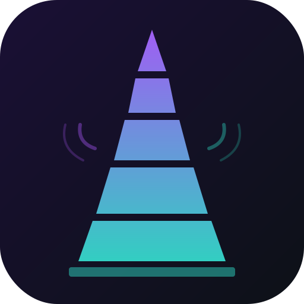
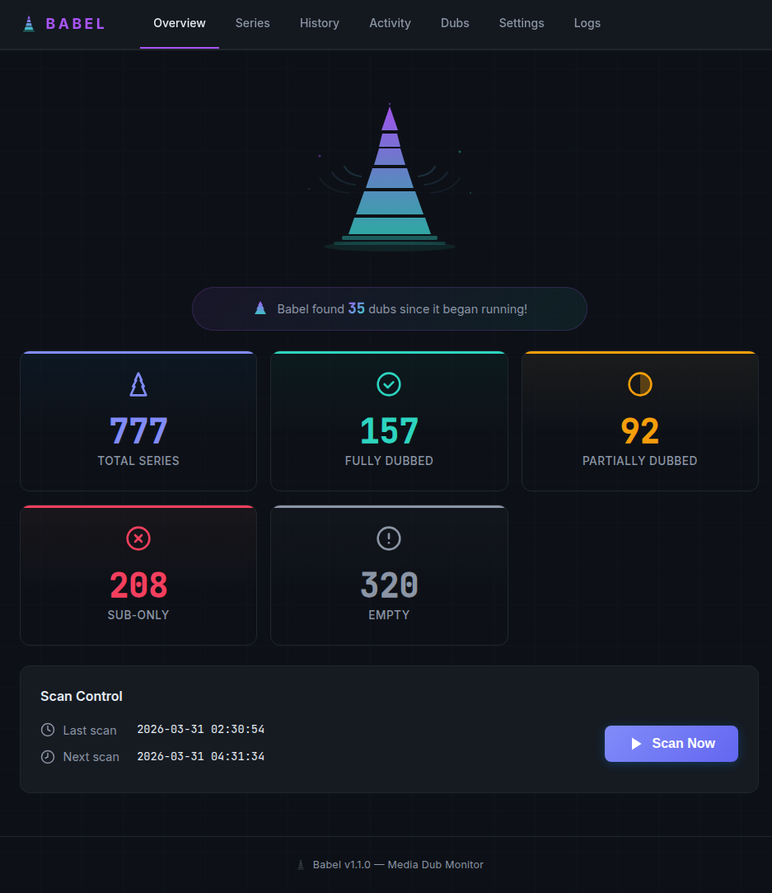
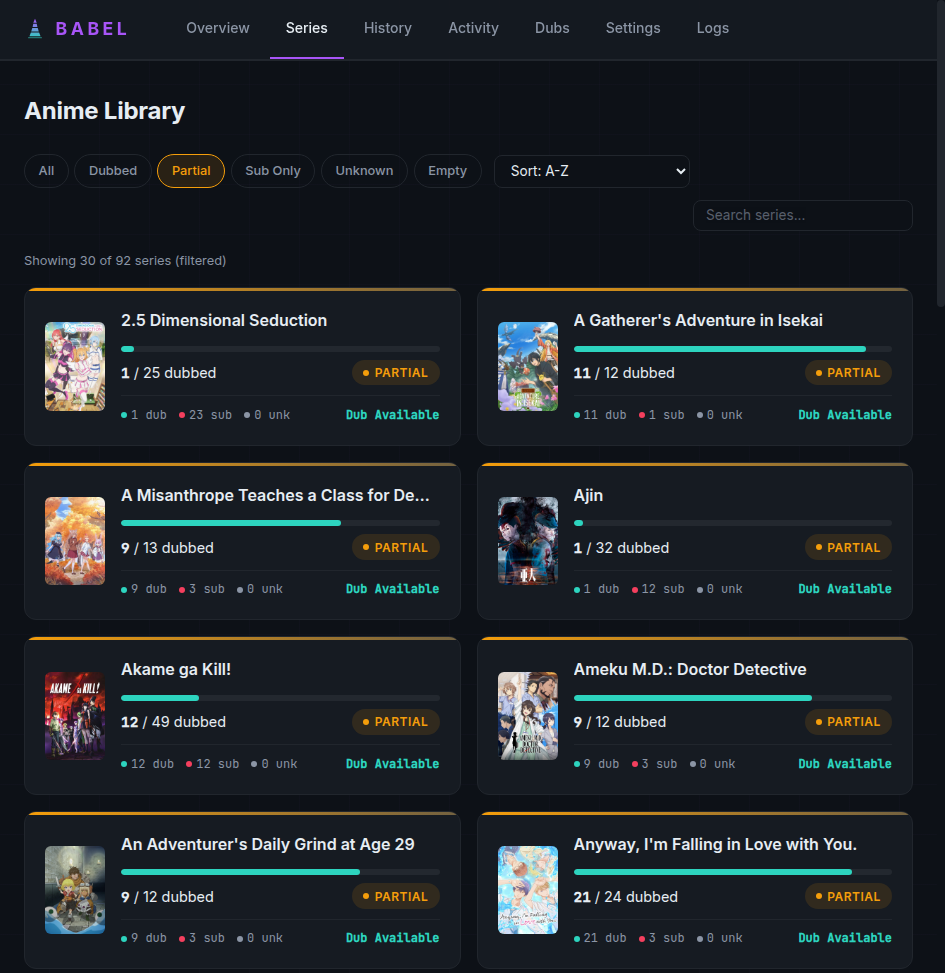

<p align="center">
  
</p>

<h1 align="center">Babel</h1>

<p align="center">
  <strong>Media Dub Detection & Upgrade Tool for Sonarr and Plex</strong>
</p>

<p align="center">
  <a href="https://hub.docker.com/r/therealshadoh/babel"></a>
  <a href="https://hub.docker.com/r/therealshadoh/babel"></a>
  <a href="https://github.com/TheRealShadoh/babel/releases"></a>
</p>

<p align="center">
  Babel monitors your media library, detects sub-only episodes, and automatically searches for English dubbed versions through Sonarr. Named after the Tower of Babel — bridging the language gap in your media library.
</p>

---

<p align="center">
  
</p>

<p align="center">
  
</p>

---

## Features

**Core**
- Automatic dub detection via Plex audio track analysis and ffprobe
- Smart upgrade searches with rate limiting, cooldowns, and max attempt caps
- Upgrade tracking — monitors downloads from search through import, auto-retries failures
- Stuck import resolution — detects and force-imports stuck Sonarr queue items (including ID mismatches)

**Intelligence**
- Dub availability lookup via MyAnimeList/Jikan — knows if a dub even exists before searching
- Dub status change notifications — alerts when a previously unlicensed show gets a dub
- Auto-overrides MAL when actual dubbed audio is detected in files

**Integrations**
- Sonarr: custom format creation, tag syncing, webhook support for instant upgrade detection
- Plex: audio indexing, collection management (Dubbed Anime, Sub-Only, etc.)
- Discord: webhook notifications for scan results and dub upgrades
- Sonarr webhook endpoint for real-time import awareness

**Dashboard**
- Polished dark-themed web UI with poster art and live scan progress
- Series browser with filter pills, search, sort, and pagination
- Activity feed with real-time download monitoring
- Dub Intelligence page with Recently Dubbed / Dub Expected / No Dub tabs
- Scan history with drilldown detail views
- Log viewer with level filtering
- All settings configurable via web UI

## Quick Start

```yaml
services:
  babel:
    image: therealshadoh/babel:latest
    container_name: babel
    ports:
      - "8686:8686"
    volumes:
      - babel-data:/app/data
    environment:
      - SONARR_URL=http://your-server:8989
      - SONARR_API_KEY=your-api-key
      - PLEX_URL=http://your-server:32400
      - PLEX_TOKEN=your-plex-token
    restart: unless-stopped

volumes:
  babel-data:
```

```bash
docker compose up -d
```

Open `http://localhost:8686` to access the dashboard.

## Configuration

All settings can be configured via environment variables or the web UI Settings page.

| Variable | Default | Description |
|---|---|---|
| `SONARR_URL` | *(required)* | Sonarr server URL |
| `SONARR_API_KEY` | | Sonarr API key (Settings > General) |
| `PLEX_URL` | | Plex server URL |
| `PLEX_TOKEN` | | Plex authentication token |
| `SCAN_INTERVAL_HOURS` | `6` | Hours between automatic scans |
| `TARGET_LANGUAGE` | `eng` | ISO 639-2 language code to search for |
| `SEARCH_COOLDOWN_DAYS` | `7` | Days before re-searching an episode |
| `SEARCH_RATE_LIMIT` | `5` | Max Sonarr searches per minute |
| `DISCORD_WEBHOOK_URL` | | Discord webhook for notifications |

### Sonarr Webhook (Recommended)

For instant upgrade detection instead of waiting for scan cycles:

1. In Sonarr, go to **Settings > Connect > + > Webhook**
2. **Name:** Babel
3. **URL:** `http://your-babel-container:8686/api/webhook/sonarr`
4. **Events:** Enable *On Import* and *On Upgrade*
5. Click **Save**

## Unraid Installation

1. In the Unraid web UI, go to **Docker > Add Container**
2. Set **Repository** to `therealshadoh/babel:latest`
3. Configure ports (8686), appdata path, and environment variables
4. Click **Apply**
5. Access the web UI at `http://your-server:8686`

## How It Works

```
Scan Cycle:
  Sonarr ──> Fetch anime series + episodes
  Plex ────> Build audio track index
  │
  For each episode:
    ├── Check audio tracks (Plex → ffprobe fallback)
    ├── Classify: DUBBED / SUB_ONLY / MISSING
    └── If SUB_ONLY → trigger Sonarr search
  │
  Post-scan:
    ├── Check download queue status
    ├── Resolve stuck imports
    ├── Sync Sonarr tags + Plex collections
    └── Send Discord notifications

Webhook (real-time):
  Sonarr import event → re-check audio → resolve upgrade
```

## API

| Endpoint | Description |
|---|---|
| `GET /api/health` | System status, version, stats |
| `GET /api/activity` | Live download queue + recent upgrades |
| `POST /api/scan` | Trigger manual scan |
| `POST /api/webhook/sonarr` | Sonarr webhook receiver |
| `POST /api/check-downloads` | Check pending upgrade status |
| `POST /api/resolve-imports` | Fix stuck Sonarr imports |
| `POST /api/lookup-dubs` | Run MAL dub availability check |

## Links

- [Docker Hub](https://hub.docker.com/r/therealshadoh/babel)
- [GitHub](https://github.com/TheRealShadoh/babel)
- [Issues](https://github.com/TheRealShadoh/babel/issues)
