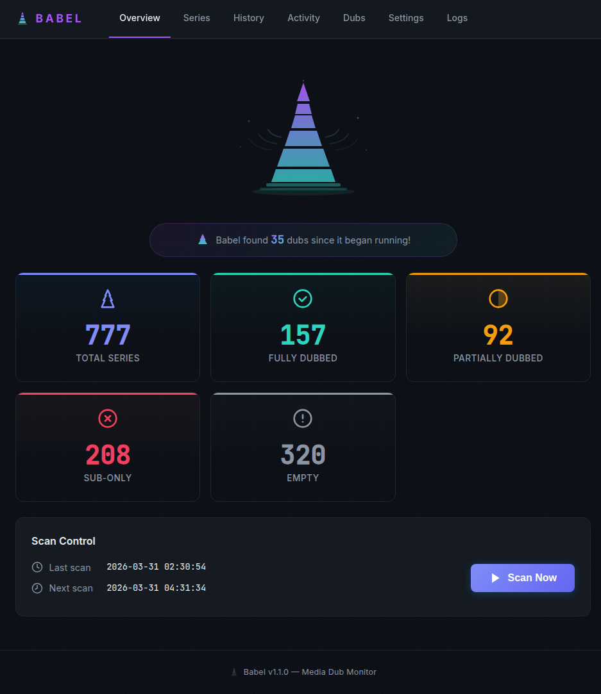
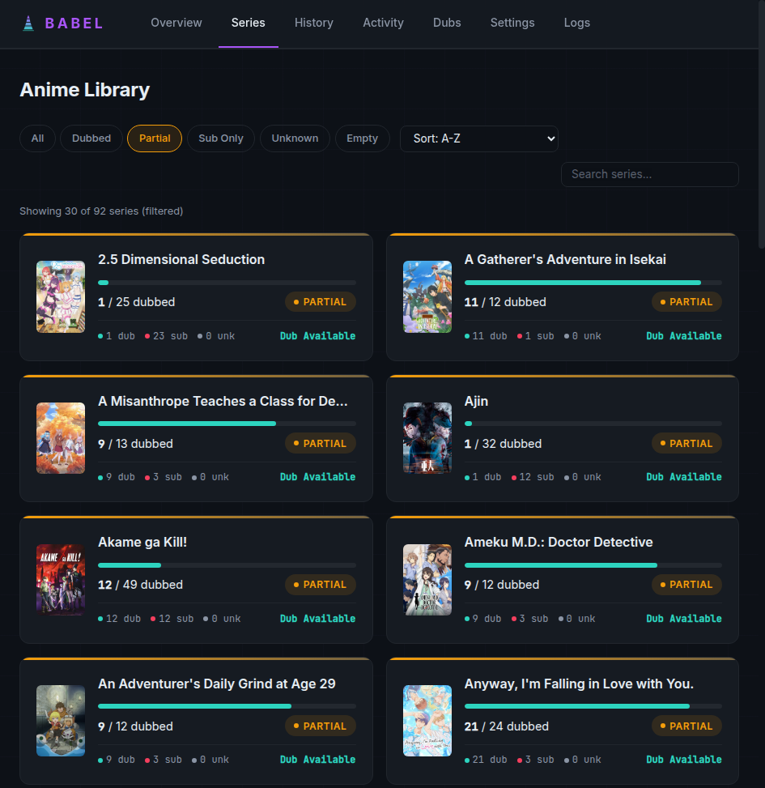

<p align="center">
  
</p>

<h1 align="center">Babel</h1>

<p align="center">
  <strong>Media Dub Detection & Upgrade Tool for Sonarr, Plex and Jellyfin</strong>
</p>

<p align="center">
  <a href="https://hub.docker.com/r/therealshadoh/babel"></a>
  <a href="https://hub.docker.com/r/therealshadoh/babel"></a>
  <a href="https://github.com/TheRealShadoh/babel/releases"></a>
</p>

<p align="center">
  Babel monitors your media library, detects sub-only episodes, and automatically searches for English dubbed versions through Sonarr. Named after the Tower of Babel — bridging the language gap in your media library.
</p>

---

<p align="center">
  
</p>

<p align="center">
  
</p>

---

## Features

**Core**
- Automatic dub detection via Plex audio track analysis and ffprobe
- Smart upgrade searches with rate limiting, cooldowns, and max attempt caps
- Upgrade tracking — monitors downloads from search through import, auto-retries failures
- Stuck import resolution — detects and force-imports stuck Sonarr queue items (including ID mismatches)

**Intelligence**
- Dub availability lookup via MyAnimeList/Jikan and Anime News Network — knows if a dub even exists before searching
- Dub status change notifications — alerts when a previously unlicensed show gets a dub
- Auto-overrides MAL when actual dubbed audio is detected in files

**Integrations**
- Sonarr: custom format creation, tag syncing, monitor-status updates, webhook support for instant upgrade detection
- Plex: audio indexing, collection management (Dubbed Anime, Sub-Only, etc.)
- Jellyfin: the same audio indexing and collection management, alongside Plex or instead of it
- Discord: webhook notifications for scan results and dub upgrades
- Sonarr webhook endpoint for real-time import awareness

**Dashboard**
- Polished dark-themed web UI with poster art and live scan progress
- Series browser with filter pills, search, sort, and pagination
- Activity feed with real-time download monitoring
- Dub Intelligence page with Recently Dubbed / Dub Expected / No Dub tabs
- Scan history with drilldown detail views
- Log viewer with level filtering
- Diagnostics that explain why a scan found nothing (filter, connection, path mapping)
- All settings configurable via web UI

## Quick Start

```yaml
services:
  babel:
    image: therealshadoh/babel:latest
    container_name: babel
    ports:
      - "8686:8686"
    volumes:
      - babel-data:/app/data
      # Strongly recommended: the same media Sonarr writes to, read-only.
      # Without it ffprobe cannot read anything, so an episode the media
      # server has not indexed yet stays "unknown" and the Sonarr webhook
      # (which probes with ffprobe) does nothing.
      - /path/to/your/media:/media:ro
    environment:
      - SONARR_URL=http://your-server:8989
      - SONARR_API_KEY=your-api-key
      - PLEX_URL=http://your-server:32400
      - PLEX_TOKEN=your-plex-token
      # If Sonarr sees the media at a different path than /media, map it:
      # - SONARR_PATH_PREFIX=/tv
      # - LOCAL_PATH_PREFIX=/media
    restart: unless-stopped

volumes:
  babel-data:
```

```bash
docker compose up -d
```

Open `http://localhost:8686` to access the dashboard. Point `SONARR_URL` and
`PLEX_URL` at the host or container name, not `localhost` — inside the
container that is Babel itself.

## Configuration

Every setting can be set as an environment variable. Most can also be changed
on the Settings page, where they take effect without a restart and override
the environment — the exceptions are marked *env only* below.

| Variable | Default | Description |
|---|---|---|
| `SONARR_URL` | | Sonarr server URL (optional — Babel can run against a media server alone) |
| `SONARR_API_KEY` | | Sonarr API key (Settings > General) |
| `PLEX_URL` | | Plex server URL |
| `PLEX_TOKEN` | | Plex authentication token |
| `JELLYFIN_URL` | | Jellyfin server URL (alongside Plex or instead of it) |
| `JELLYFIN_API_KEY` | | Jellyfin API key (Dashboard > API Keys) |
| `MEDIA_SERVER` | `auto` | `auto` uses every configured server; `plex`/`jellyfin` restrict a scan to one; `none` disables both |
| `SCAN_INTERVAL_HOURS` | `6` | Hours between automatic scans |
| `TARGET_LANGUAGE` | `eng` | ISO 639-2 language code to search for |
| `SEARCH_COOLDOWN_DAYS` | `7` | Days before re-searching an episode |
| `SEARCH_RATE_LIMIT` | `5` | Max Sonarr searches per minute |
| `MAX_SEARCH_ATTEMPTS` | `3` | Searches per 7-day window before an episode with no results is left alone; `0` = unlimited |
| `ANIME_FILTER` | `type` | Which Sonarr series to scan: `type` (series type "anime"), `all`, or `tag:YourTag` |
| `SONARR_PATH_PREFIX` | | The root Sonarr reports files under (e.g. `/tv`), if it differs from Babel's |
| `LOCAL_PATH_PREFIX` | `/media` | Where that same root is mounted inside the Babel container |
| `PLEX_PATH_PREFIX` | | Where Plex sees that root, if different again (defaults to `LOCAL_PATH_PREFIX`) |
| `JELLYFIN_PATH_PREFIX` | | Where Jellyfin sees it (defaults to `PLEX_PATH_PREFIX`, then `LOCAL_PATH_PREFIX`) |
| `AUTO_TAG_SONARR` | `true` | Tag series in Sonarr as `babel:dubbed` / `babel:partial-dub` / `babel:sub-only` |
| `AUTO_COLLECTIONS_PLEX` | `true` | Maintain "Dubbed Anime" / "Sub-Only Anime" collections on Plex and Jellyfin |
| `AUTO_RESOLVE_IMPORTS` | `true` | Fix stuck Sonarr imports for episodes Babel searched for |
| `STUCK_IMPORT_DRY_RUN` | `false` | Log what stuck-import resolution would do without touching the queue |
| `SHOW_THUMBNAILS` | `true` | Poster art in the dashboard |
| `AUTO_MONITOR_DUBS` | `true` | Monitor episodes in Sonarr when a dub is available, so Sonarr keeps looking on its own |
| `DUB_LOOKUP_ANN` | `true` | Check Anime News Network when MyAnimeList cannot settle whether a dub exists |
| `DISCORD_WEBHOOK_URL` | | Discord webhook for notifications |
| `WEBHOOK_SECRET` | | If set, the Sonarr webhook requires `?apikey=` (or `X-Api-Key` header) to match |
| `AUTH_USERNAME` / `AUTH_PASSWORD` | | If both are set, the whole dashboard requires HTTP Basic Auth. Overrides anything set in Settings → Access |
| `ALLOW_CROSS_ORIGIN_WRITES` | `false` | *env only.* Allow state-changing requests from other origins (off by default) |
| `LOG_LEVEL` | `INFO` | *env only.* Python log level |
| `DB_PATH` | `/app/data/babel.db` | *env only.* SQLite database; the log file is written next to it |
| `BABEL_BUILD` | | *env only.* Stamped into the image at build time; surfaced as `revision` on `/api/health` |
| `PUID` / `PGID` | `1000` / `1000` | *env only.* UID/GID the container runs as — match your host's media/data ownership |
| `FFPROBE_TIMEOUT` | `30` | *env only.* Seconds a single ffprobe may run before it is killed |
| `FFPROBE_KILL_GRACE` | `5` | *env only.* Seconds after SIGTERM before a stuck ffprobe is SIGKILLed |
| `FFPROBE_MAX_CONCURRENT` | `4` | *env only.* Max simultaneous ffprobe children — caps what a hung mount can strand |
| `FFPROBE_SLOT_TIMEOUT` | `15` | *env only.* Seconds to wait for a free probe slot before skipping the file |
| `WATCHDOG_INTERVAL` | `1` | *env only.* Seconds between event-loop heartbeats |
| `WATCHDOG_UNHEALTHY_LAG` | `15` | *env only.* Event-loop lag (s) above which `/api/health` returns 503 |
| `WATCHDOG_ABORT_LAG` | `300` | *env only.* Event-loop lag (s) after which Babel exits so Docker restarts it; `0` disables |

### Plex, Jellyfin, or both

Plex and Jellyfin are configured independently — each has its own URL,
credential and path prefix — and either one on its own is a complete setup.
Configure both and Babel uses both: a lookup asks Plex first and falls back to
Jellyfin, so a file only one of them has indexed is still classified, and
collections (Dubbed Anime, Sub-Only Anime, …) are kept in sync on both.

`MEDIA_SERVER` only narrows that: `auto` (the default) uses every configured
server, `plex` or `jellyfin` restricts a scan to that one even when both are
set up, and `none` turns both off and leaves detection to `ffprobe`. If one
server is down when a scan starts, Babel logs it and carries on with the other.

For Jellyfin, create an API key under **Dashboard → API Keys** and set
`JELLYFIN_URL` / `JELLYFIN_API_KEY`. If Jellyfin sees your files at a different
path than Sonarr does, set `JELLYFIN_PATH_PREFIX` — it falls back to
`PLEX_PATH_PREFIX`, then `LOCAL_PATH_PREFIX`.

### Keeping Sonarr monitoring in step with dubs

A show written off as sub-only is often left unmonitored in Sonarr, so when a
dub finally lands nothing goes looking for it. Babel keeps monitoring in step
(**Settings → Automation → Monitor episodes in Sonarr when a dub is
available**, `AUTO_MONITOR_DUBS`, on by default):

- when it triggers a dub search for a sub-only episode, that episode is set to
  monitored first, so Sonarr keeps looking on its own schedule instead of
  getting the single search Babel asked for, and
- when the daily MyAnimeList lookup reports a dub for a series it had not been
  expecting one for, that series' sub-only episodes are monitored.

Babel only ever *adds* monitoring, only to sub-only episodes of series it
tracks, and never unmonitors anything. Turn it off if you keep episodes
deliberately unmonitored and don't want Babel touching that.

### How dub availability is decided

Two sources, asked in order of cost:

1. **MyAnimeList** (via the Jikan API) records a show's *licensors*. That is an
   inference — a licensor may only ever distribute a show subtitled — but it is
   one request and covers most of the catalogue. A recognised dub licensor
   (Funimation, Crunchyroll, Sentai, HIDIVE, Netflix, Amazon, Muse, …) reads as
   **available**; some other licensor reads as **likely**; nothing recorded on a
   finished show reads as **unlikely**. A show still airing usually has no
   licensor recorded yet, so it stays **unknown** and is re-checked, rather than
   being written off as having no dub.
2. **Anime News Network** lists the actual voice cast per language, so an
   English cast is direct evidence a dub was produced. Babel asks ANN only about
   the titles MyAnimeList could not settle (`DUB_LOOKUP_ANN`, on by default),
   because each one costs two more requests at ANN's ~1/second guidance. ANN
   only answers on an exact title match — crediting one show's dub to its
   sequel would be worse than no answer — and if ANN is unreachable or has no
   entry, MyAnimeList's verdict stands.

Neither source can be reached from a container with no outbound HTTPS, and the
symptom is silence: the Dub Intelligence page just stays empty. To check from
the machine actually running Babel:

```bash
docker exec babel python scripts/check_dub_lookup.py
```

With no arguments it checks a few shows whose dubs are beyond dispute, prints
what each source said, and exits non-zero if the services are unreachable (or
if a known-dubbed show does not come back "available"). Pass titles of your own,
or `--from-library 10` to check shows from your library. **Run Diagnostics** on
the Settings page does the same thing as a single canary lookup.

Dub availability is advisory: it drives the Dub Intelligence page, the badges on
each series, and (with `AUTO_MONITOR_DUBS` on) monitoring when a dub is newly
announced. It never blocks a search — a sub-only episode is searched for on the
normal cooldown whatever MyAnimeList thinks.

### Nothing showing up?

If Sonarr and Plex/Jellyfin both connect but the dashboard stays empty, click
**Run Diagnostics** on the Settings page (or `GET /api/diagnostics`). It checks,
in order, each connection, how many Sonarr series match the Anime Filter (with
a breakdown of the series types Sonarr actually has), whether those series have
downloaded files, the media server's libraries, whether Sonarr's paths resolve
to something that exists inside the container, active ignore rules, and what
the last scan did.

The most common cause is the filter: `ANIME_FILTER` defaults to `type`, which
matches only series whose Sonarr **series type** is "anime". If your shows are
type "standard", set the Anime Filter to `all` or `tag:YourTag`, or change the
series type in Sonarr. A scan that matches nothing now records that reason in
its History entry instead of quietly reporting zero.

`all` means Babel reads the audio tracks of every series in Sonarr — it does
not download anything by itself. Searches are only triggered for episodes that
turn out to be sub-only, so an already-English library adds scan time and
nothing else. It is worth knowing that a genuinely foreign-language show
caught by `all` *would* get dub searches; `tag:YourTag` is the precise option
if that matters to you.

### Unresponsive media mounts

Babel reads audio tracks with `ffprobe`, so it is exposed to whatever storage
holds your media. If that storage stops responding — a suspended ZFS pool, a
dead NFS/SMB share — reads block indefinitely, and an unbounded probe can take
the whole app with it.

Babel is built so that a hung mount degrades instead of wedging:

- No filesystem call runs on the event loop. Only the `ffprobe` child touches
  the media path, and it can be killed. A blocked event loop would stop
  serving HTTP *and*, under uvloop, stop reaping exited children — which is how
  a storage blip turns into thousands of zombie processes.
- Every probe is bounded by `FFPROBE_TIMEOUT`, and no more than
  `FFPROBE_MAX_CONCURRENT` may be in flight, so a dead mount strands a handful
  of processes rather than one per episode.
- Killed children are always reaped, including when a scan is cancelled or the
  app shuts down mid-probe.
- Affected episodes are recorded as `UNKNOWN` and retried on the next scan;
  the dashboard stays responsive throughout.
- If the loop does stall anyway, the watchdog logs it, `/api/health` starts
  returning 503, and past `WATCHDOG_ABORT_LAG` the process exits so
  `restart: unless-stopped` can recover it. Docker never restarts a container
  for being *unhealthy* — only for exiting — so this is what closes that gap.

`scripts/repro_hung_mount.py` exercises all of the above against a fake mount
that never responds; run it with `--legacy` to see the behaviour before the 1.1 hardening.

### Security

Babel has no built-in accounts and, by default, no authentication — anyone who
can reach the port can view and change settings (including your Sonarr API
key and Plex token). For anything beyond a trusted home LAN, do one of:

- Set a username and password under **Settings → Access**, or
- Set `AUTH_USERNAME` + `AUTH_PASSWORD` in the container environment, or
- Put Babel behind a reverse proxy (Caddy, Traefik, Nginx Proxy Manager, etc.)
  that handles authentication.

A password set in Settings is stored hashed (PBKDF2-SHA256). The environment
variables always win over the stored values, so you can recover access from
compose if you ever lock yourself out.

`GET /api/health` and `POST /api/webhook/sonarr` are always reachable without
Basic Auth credentials (health checks and Sonarr can't complete an interactive
login). **Set `WEBHOOK_SECRET`**: without it, anything that can reach the port
can post a webhook that rewrites an episode's status. The path in a webhook is
only ever probed if it is an absolute local path, never a URL.

Because the dashboard's forms carry no per-request token, Babel also refuses
state-changing requests that arrive from another origin — otherwise any page
open in another browser tab could repoint your Sonarr connection. Set
`ALLOW_CROSS_ORIGIN_WRITES=true` only if you deliberately drive Babel's
endpoints from a different origin.

### Sonarr Webhook (Recommended)

For instant upgrade detection instead of waiting for scan cycles:

1. In Sonarr, go to **Settings > Connect > + > Webhook**
2. **Name:** Babel
3. **URL:** `http://your-babel-container:8686/api/webhook/sonarr` (append
   `?apikey=your-secret` if `WEBHOOK_SECRET` is set)
4. **Events:** Enable *On Import* and *On Upgrade*
5. Click **Save**

## Unraid Installation

A container template is in [`templates/babel.xml`](templates/babel.xml).
Either import it (Docker > Add Container > Template repositories) or set the
container up by hand:

1. In the Unraid web UI, go to **Docker > Add Container**
2. Set **Repository** to `therealshadoh/babel:latest`
3. Map port 8686, the appdata path to `/app/data`, and your media share to `/media` (read-only)
4. Set the Sonarr and Plex/Jellyfin environment variables
5. Click **Apply** and open `http://your-server:8686`

## How It Works

```
Scan Cycle:
  Sonarr ──> Fetch anime series + episodes
  │
  For each episode:
    ├── Check DB cache — unchanged files skip straight to their known status
    ├── Otherwise check audio tracks (Plex → Jellyfin → ffprobe, using
    │   whichever servers are configured; each library index is only built
    │   the first time a scan actually needs it, so a cycle where nothing
    │   changed never touches them)
    ├── Classify: DUBBED / SUB_ONLY / MISSING
    └── If SUB_ONLY → trigger Sonarr search
  │
  Post-scan:
    ├── Check download queue status
    ├── Resolve stuck imports
    ├── Sync Sonarr tags + media server collections (Plex and/or Jellyfin)
    ├── Monitor dub-expected episodes in Sonarr
    └── Send Discord notifications

Webhook (real-time):
  Sonarr import event → re-check audio via ffprobe → resolve upgrade

Note: Sonarr is optional — with only a media server configured, Babel runs in
a read-only mode (detection and collections, no searches).
```

## API

| Endpoint | Description |
|---|---|
| `GET /api/health` | System status, version, stats |
| `GET /api/activity` | Live download queue + recent upgrades |
| `POST /api/scan` | Trigger manual scan |
| `POST /api/scan/stop` | Cancel the running scan after the current series |
| `POST /api/webhook/sonarr` | Sonarr webhook receiver (`?apikey=` if `WEBHOOK_SECRET` is set) |
| `POST /api/check-downloads` | Check pending upgrade status |
| `POST /api/resolve-imports` | Fix stuck Sonarr imports |
| `POST /api/lookup-dubs` | Run the dub availability check (MyAnimeList, then ANN where needed) |
| `POST /api/setup-sonarr-dub` | Create/assign a Sonarr custom format that prefers dual-audio releases |
| `GET /api/diagnostics` | Why a scan is finding nothing: connections, filter match, paths, ignores, dub-lookup reachability |
| `POST /api/search/{episode_id}` | Trigger a Sonarr search for one episode |
| `POST /api/search-all/{series_id}` | Search every sub-only episode of a series |
| `POST /api/series/{series_id}/exclude` | Toggle a series out of automatic searching |
| `GET /api/scan/progress` | Live scan progress (HTML partial) |
| `GET /api/logs?lines=200&level=ERROR` | Tail the application log |
| `POST /api/test-sonarr` · `/api/test-plex` · `/api/test-jellyfin` | Connection tests; a new URL requires its key in the form |
| `GET /api/discover/sonarr` · `/api/discover/plex` | Root folders/tags and media-server libraries, with ignore state |
| `POST /api/ignore-path` · `/api/ignore-path/remove/{id}` | Manage ignore patterns |

State-changing endpoints require a same-origin browser request (or
`ALLOW_CROSS_ORIGIN_WRITES=true`) and, when auth is configured, Basic Auth.
Only `/api/health` and the Sonarr webhook are exempt from auth.

## Data & Backups

Everything Babel needs to keep is under `/app/data` (the `babel-data` volume
in the Quick Start example): the SQLite database (`babel.db`) and rotating
application logs (`babel.log*`). Back up that volume to preserve scan
history, upgrade tracking, and settings saved via the web UI — the container
itself is stateless otherwise.

## Links

- [Docker Hub](https://hub.docker.com/r/therealshadoh/babel)
- [GitHub](https://github.com/TheRealShadoh/babel)
- [Issues](https://github.com/TheRealShadoh/babel/issues)
